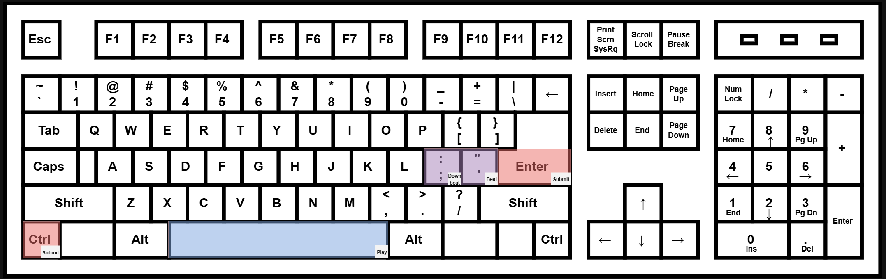

## Beat Tracking

**Automatic Beat Tracking** is a [traditional MIR task] which marks the temporal location of [beats], often also including downbeats (the first beat of a measure). This is equivalent to when you would tap your finger or your foot to a piece of music.

<!--  -->

**Instructions:**
 - Play audio clip
 - Use hotkeys (semicolon (;) for downbeat, quote (') for beat) to place a beat annotation.
 - Press replay hotkey (R -> space) to listen back

> *Note: Please use wired headphones or speakers for this task, since Bluetooth headphones can have a problematic amount of latency.*

> *Note: Playback latency can differ between systems, so use the mute button if necessary*

 

More details

<strong>Hotkey keyboard layout:</strong>

----

[beats]: https://en.wikipedia.org/wiki/Beat_(music)
[traditional MIR task]: https://www.music-ir.org/mirex/wiki/2025:Audio_Beat_Tracking
