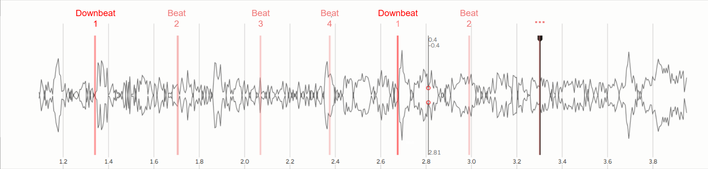

## Beat Tracking

**Automatic Beat Tracking** is a [traditional MIR task] which marks the temporal location of [beats], often also including downbeats (the first beat of a measure). This is equivalent to when you would tap your finger or your foot to a piece of music.

Please use wired headphones or speakers for this task, since Bluetooth headphones can have a problematic amount of latency. We'd like for these annotations to be as accurate as possible, but we understand that sometimes there can be some uncertainty.  

 

**Instructions:**
 - Play audio clip
 - Use hotkeys (semicolon (;) for downbeat, quote (') for beat) to place a beat annotation.
 - Press replay hotkey (R -> space) to listen back

 

Depending on your system there can be a bit of latency for sounding the beats, so you can mute it if necessary.

----

[beats]: https://en.wikipedia.org/wiki/Beat_(music)
[traditional MIR task]: https://www.music-ir.org/mirex/wiki/2025:Audio_Beat_Tracking
