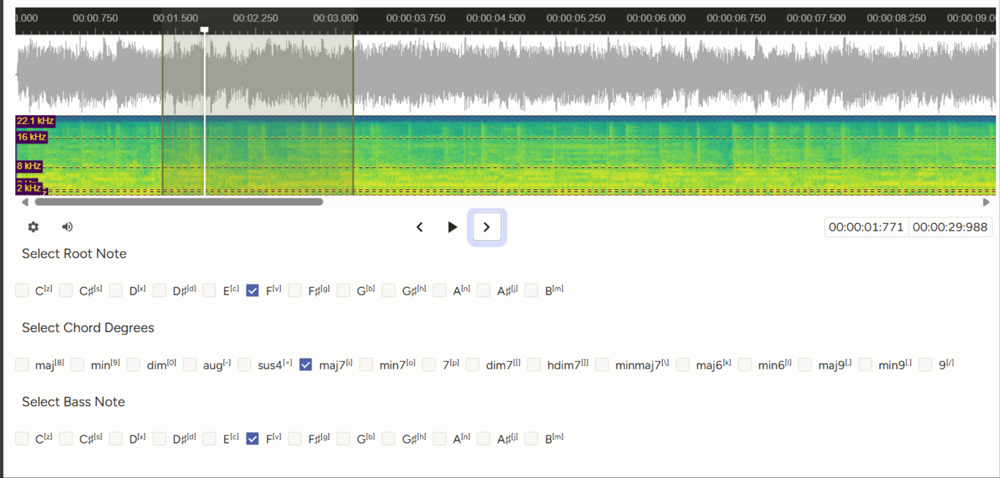

---
title: Chord Annotation
layout: home
--- 
## Chord Annotation
**Chord Annotation** is a traditional MIR task concerned with labeling sequences of chords in a song. In this task, an audio segment is partitioned into its respective chord labels. Tasks typically either use a selection of popular chord classes or Harte notation (a rigid yet comprehensive way to notate chords). We chose to use popular chord classes[^1] in order to streamline the workflow.

Note: If you aren't familiar with these concepts, you might be better suited for another challenge. This task calls for strong familiarity with music theory as well as ear training. 

 

 
   
   

**Instructions:**
 - Listen for chord changes
 - Identify beginning and end location of a chord segment (drag to create audio region)
    - If you're uncertain about timing, you can enable looping in the audio element settings and adjust the start and end location of your audio region.
    - Try to minimize segment gaps and overlap. This will be fixed in post processing within a certain threshold.
 - Press hotkey (1) to create chord segment
 - Use pitch and chord class hotkeys to annotate (see figure below)
    - These hotkeys sound as you press! Use them to identify the chords while listening.
    - The pitch class hotkeys annotate both the root note and the bass note. If you'd like to change the bass note, you can scroll down and select it manually.  

 

----

[^1]: These classes were chosen pretty arbitrarily from Table 2 in the [Harte notation] paper. If you feel like a chord class is common enough to warrant being included in these hotkeys, please let me know!

[beats]: https://en.wikipedia.org/wiki/Beat_(music)
[traditional MIR task]: https://www.music-ir.org/mirex/wiki/2025:Audio_Chord_Estimation
[Harte notation]: https://ismir2005.ismir.net/proceedings/1080.pdf

