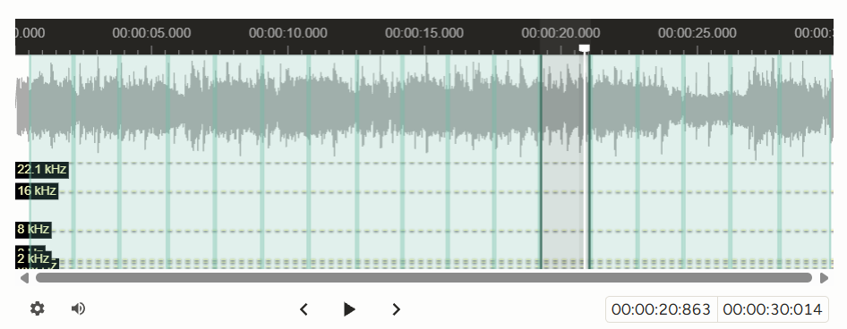
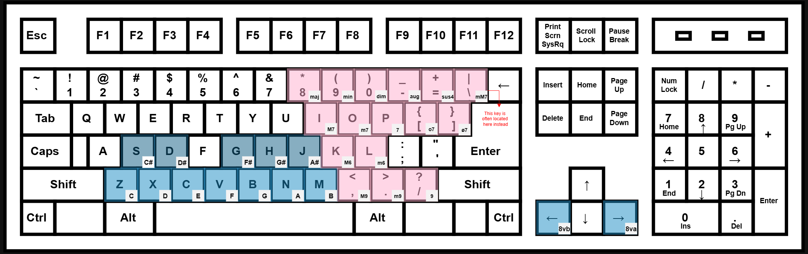

---
title: Chord Annotation
layout: home
--- 
## Chord Annotation
**Chord Annotation** is a traditional MIR task concerned with labeling sequences of chords in a song. In this task, an audio segment is partitioned into its respective chord labels. Tasks typically either use a selection of popular chord classes or Harte notation (a rigid yet comprehensive way to notate chords). We chose to use popular chord classes[^1] in order to streamline the workflow.

 

 

**Instructions:**
 - Listen through and mentally identify chord change locations
 - Return to start and replay using hotkey (R -> space)
 - Press semicolon (;) **each time** you hear a chord change
    - This helps create exact chord segments that span the audio clip
    - Make sure to press semicolon at the end of the clip to create the last audio region
 - Click on each region and use pitch and chord class hotkeys to annotate (see figure below)
    - These hotkeys sound as you press! Use them to identify the chords while listening.
    - The pitch class hotkeys annotate both the root note and the bass note. If you'd like to change the bass note, you can scroll down and select it manually

*Note: This task calls for strong familiarity with music theory and some amount of ear training.*

 

----

[^1]: These classes were chosen pretty arbitrarily from Table 2 in the [Harte notation] paper. If you feel like a chord class is common enough to warrant being included in these hotkeys, please let me know!

[beats]: https://en.wikipedia.org/wiki/Beat_(music)
[traditional MIR task]: https://www.music-ir.org/mirex/wiki/2025:Audio_Chord_Estimation
[Harte notation]: https://ismir2005.ismir.net/proceedings/1080.pdf

