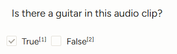
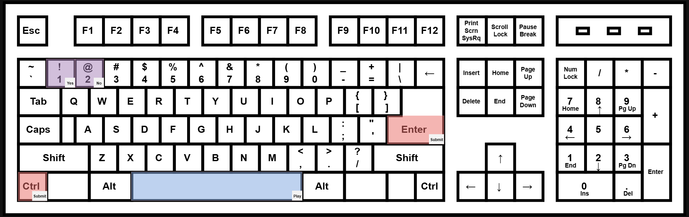

## Instrument Recognition
**Instrument Recognition** is a traditional MIR task concerned with identifying which instruments are in an audio clip. 

**Instructions:**
 - Play audio clip (Space)
 - Listen for instrument
 - Use hotkeys (1 or 2) to confirm whether or not the instrument is in the audio
    - If you hear this instrument and you are **sure** it's in the audio clip, you may move onto the next without listening all the way through
 - Submit the task (Ctrl+Enter)

*Note: This task is designed to be possible to complete with only hotkeys (play -> choice -> submit)*

 

More details

<strong>Hotkey keyboard layout:</strong>

----

