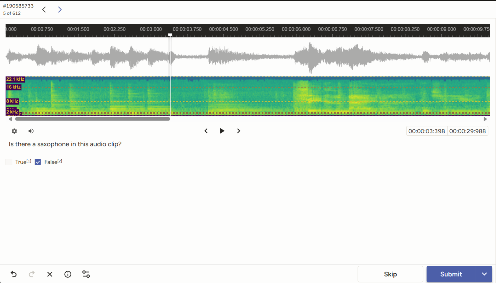

## Instrument Recognition
**Instrument Recognition** is a traditional MIR task concerned with identifying which instruments are in an audio clip. 

 

**Instructions:**
 - Play audio clip
 - Listen for instrument
 - Use hotkeys (1 or 2) to confirm whether or not the instrument is in the audio.
    - If you find this instrument and you are **sure** it's in the audio clip, you may move onto the next without listening all the way through. 

----

